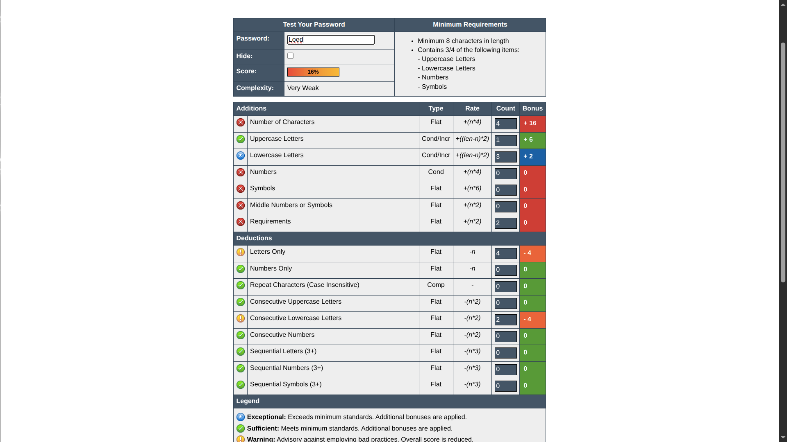
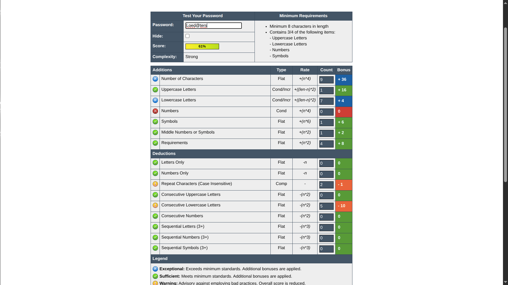
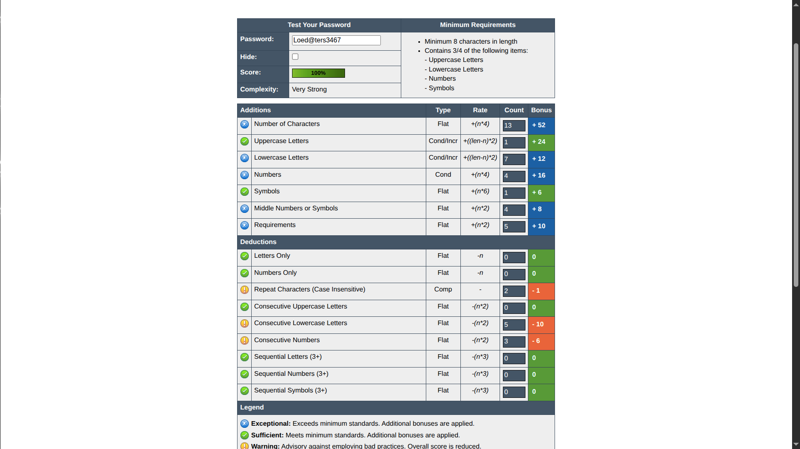
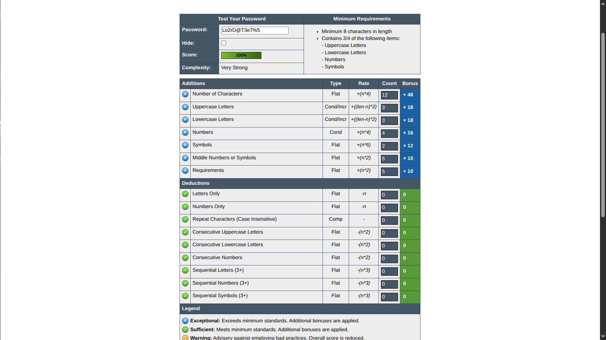

# ElateLabs-task6
Password Evaluation

This repoditory displays different password and their evaluation by a password evaluator

1. Weak Password : easily breakable


2. Moderate Password :


3. Strong Password :


4. Very Strong Password :



Tips For creating a strong password :
```
-> Use at least 12–16 characters for sufficient entropy.

-> Include a mix of:

    -> Uppercase letters (A–Z)

    -> Lowercase letters (a–z)

    -> Numbers (0–9)

    -> Special characters (!@#$%^&* etc.)

-> Avoid common passwords like 123456, password, or qwerty.

-> Do not use personal information such as names, birthdays, or usernames.

-> Create passphrases from random words (e.g., horse-staple-cloud-echo).

-> Use a unique password for each account or service.

-> Store passwords securely using a password manager (e.g., Bitwarden, KeePassXC).

-> Enable two-factor authentication (2FA) whenever available.
```

1. Brute Force Attack

The script at Data/Scripts/bruteForce.py show a implementation how brute force attacks work by trying to find all possible combinations that can be made within a constraint here the max length and characters


2. Dictionary Attack

The script at Data/Scripts/dictionaryAttack.py show a implementation of dictoinary attacks work by trying to find the password by choosing different words from a ditionary file